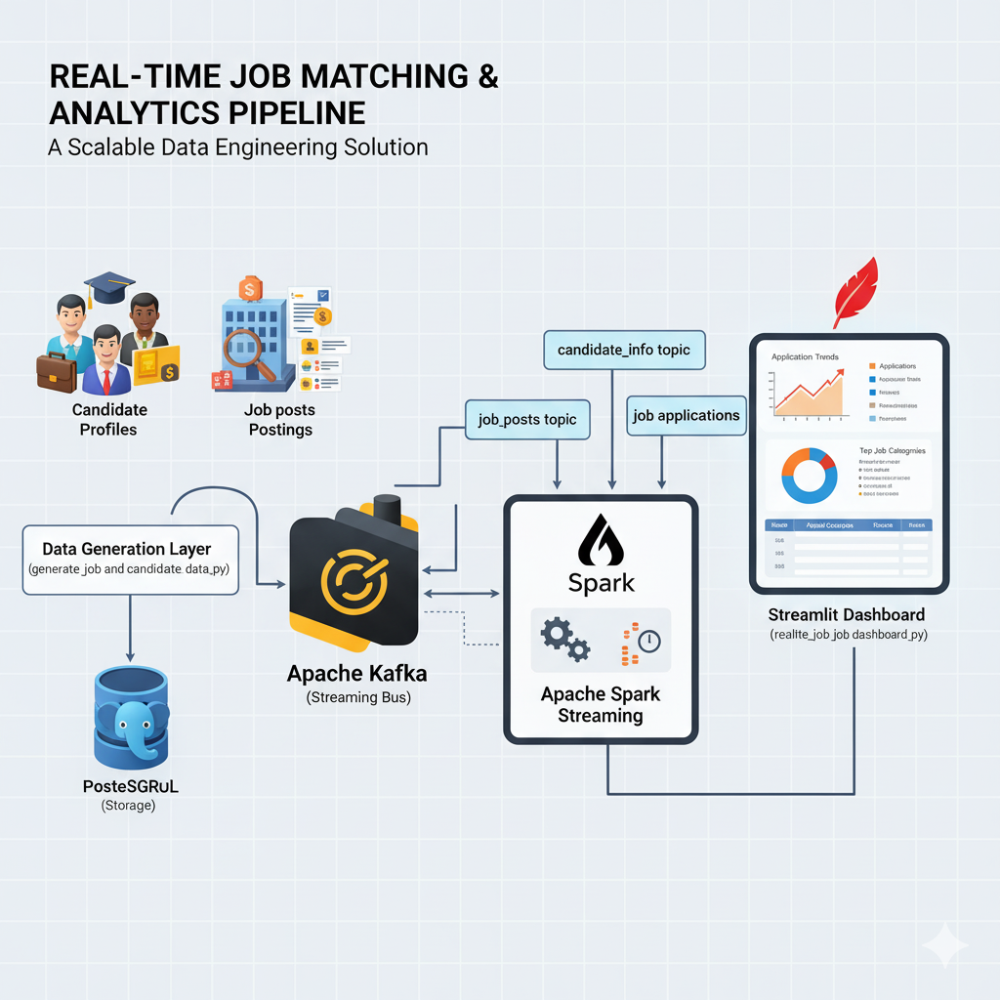

# Real-Time Job Matching & Analytics Pipeline

A scalable data engineering solution for generating, matching, and analyzing job market data in real-time using Apache Kafka, Apache Spark Structured Streaming, PostgreSQL, and Streamlit.

## 🎯 Overview

This pipeline simulates a live job marketplace that continuously:
- Generates synthetic job postings and candidate profiles
- Streams data through Kafka topics for distributed processing
- Performs intelligent candidate-to-job matching using Spark Structured Streaming
- Persists data in PostgreSQL for durability
- Visualizes real-time analytics through an interactive dashboard


## 🏗️ Architecture



```
┌─────────────────────────────────────────────────────────────────┐
│                     Data Generation Layer                        │
│              (generate_job_and_candidate_data.py)               │
└────────────┬────────────────────────────────┬───────────────────┘
             │                                │
             ▼                                ▼
    ┌────────────────┐              ┌──────────────────┐
    │  PostgreSQL    │              │   Apache Kafka   │
    │   (Storage)    │              │  (Streaming Bus) │
    └────────────────┘              └─────────┬────────┘
                                              │
                    ┌─────────────────────────┼─────────────────────┐
                    │                         │                     │
                    ▼                         ▼                     ▼
            candidate_info              job_posts          job_applications
                topic                     topic                  topic
                    │                         │                     │
                    └─────────────┬───────────┘                     │
                                  ▼                                 │
                    ┌──────────────────────────┐                    │
                    │  Apache Spark Streaming  │                    │
                    │ (real_time_job_          │                    │
                    │  applications.py)        │ ───────────────────┘
                    └──────────────────────────┘
                                  │
                                  ▼
                    ┌──────────────────────────┐
                    │   Streamlit Dashboard    │
                    │ (real_time_job_          │
                    │  dashboard.py)           │
                    └──────────────────────────┘
```

## 📋 Prerequisites

### Required Software
- **Python**: 3.8+
- **Apache Kafka**: 2.8+ (with Zookeeper)
- **Apache Spark**: 3.3+
- **PostgreSQL**: 12+
- **Docker & Docker Compose**: 20.10+ (recommended for containerized deployment)

### Python Dependencies
```bash
pip install psycopg2-binary kafka-python numpy python-dotenv pyspark streamlit plotly streamlit-autorefresh
```

## 🚀 Quick Start

### 1. Environment Setup

Create a `.env` file in the project root:

```env
# PostgreSQL Configuration
POSTGRES_HOST=localhost
POSTGRES_PORT=5432
POSTGRES_DB=job_market_db
POSTGRES_USER=your_username
POSTGRES_PASSWORD=your_password

# Kafka Configuration
KAFKA_BOOTSTRAP_SERVERS=localhost:9092
ZOOKEEPER_CLIENT_PORT=2181
ZOOKEEPER_TICK_TIME=2000

# Topic Names
TOPIC_CANDIDATES=candidate_info
TOPIC_JOBS=job_posts
TOPIC_APPLICATIONS=job_applications
```

**Note for Docker deployments:** When running scripts inside containers, Kafka should be accessible at `kafka_job:29092` (internal network). Update your scripts' Kafka connection accordingly:

```python
# For services running inside Docker network
KAFKA_BOOTSTRAP_SERVERS = "kafka_job:29092"

# For services running on host machine (Windows/Mac/Linux)
KAFKA_BOOTSTRAP_SERVERS = "localhost:9092"
```

### 2. Infrastructure Deployment

#### Option A: Docker Compose (Recommended)

Uncomment and configure the provided `docker-compose.yml`, then run:

```bash
docker-compose up -d
```

This will start:
- PostgreSQL (port 5432)
- Zookeeper (port 2181)
- Kafka broker (ports 9092, 29092)
- Spark master (port 8080)
- Spark worker (port 8081)

#### Option B: Manual Setup

Ensure PostgreSQL, Kafka, and Spark are running and accessible at the configured ports.

### 3. Running the Pipeline

Execute the three scripts in the following order (in separate terminals):

#### Terminal 1: Data Generation & Streaming

**Run on host machine (not in container):**

```bash
python generate_job_and_candidate_data.py
```
**Purpose**: Generates 1,000 synthetic records and publishes them to Kafka topics.

**Important:** This script should connect to `localhost:9092` for Kafka and `localhost:5432` for PostgreSQL.

#### Terminal 2: Real-Time Matching Engine

**If using Docker deployment:**

```bash
# Step 1: Copy required files to Spark master container
docker cp data_used.py spark-master1:/opt/bitnami/spark/
docker cp real_time_job_applications.py spark-master1:/opt/bitnami/spark/

# Step 2: Submit Spark job
docker exec -it spark-master1 spark-submit \
  --master spark://spark-master:7077 \
  --deploy-mode client \
  --packages org.apache.spark:spark-sql-kafka-0-10_2.12:3.5.3,org.postgresql:postgresql:42.7.5,org.apache.spark:spark-avro_2.12:3.5.3 \
  --executor-memory 2g \
  --executor-cores 2 \
  --driver-memory 2g \
  --conf spark.sql.adaptive.enabled=false \
  --conf spark.streaming.stopGracefullyOnShutdown=true \
  /opt/bitnami/spark/real_time_job_applications.py
```

**If running locally (without Docker):**

```bash
spark-submit \
  --packages org.apache.spark:spark-sql-kafka-0-10_2.12:3.5.3,org.postgresql:postgresql:42.7.5 \
  --executor-memory 2g \
  --executor-cores 2 \
  real_time_job_applications.py
```

**Purpose**: Consumes candidate and job data, performs intelligent matching, and produces application events.

#### Terminal 3: Analytics Dashboard
```bash
streamlit run real_time_job_dashboard.py
```
**Purpose**: Launches an interactive dashboard at `http://localhost:8501` for real-time visualization.

## 📦 Component Details

### 1. Data Generation (`generate_job_and_candidate_data.py`)

**Responsibilities:**
- Generates realistic synthetic data for job postings and candidate profiles
- Persists records to PostgreSQL for durability
- Streams records to Kafka topics for real-time processing

**Key Features:**
- **Job Posts**: Industry-specific roles with location, skills, certifications, salary ranges, and experience requirements
- **Candidates**: Complete profiles including education, work history, skills, certifications, and salary expectations
- **Data Quality**: Location-industry correlation, age-education alignment, experience-based salary calculations

**Database Schema:**

```sql
-- job_posts table
CREATE TABLE job_posts (
    post_id UUID PRIMARY KEY,
    company VARCHAR(255),
    job_title VARCHAR(255),
    job_category VARCHAR(100),
    industry VARCHAR(100),
    location_country VARCHAR(100),
    location_city VARCHAR(100),
    required_skills TEXT[],
    certifications TEXT[],
    salary_min DECIMAL,
    salary_max DECIMAL,
    experience_level VARCHAR(50),
    employment_type VARCHAR(50),
    work_mode VARCHAR(50),
    posted_date DATE,
    deadline_date DATE
);

-- candidate_info table
CREATE TABLE candidate_info (
    candidate_id UUID PRIMARY KEY,
    full_name VARCHAR(255),
    gender VARCHAR(20),
    birth_year INTEGER,
    nationality VARCHAR(100),
    location_country VARCHAR(100),
    education_level VARCHAR(100),
    graduation_year INTEGER,
    gpa DECIMAL,
    current_company VARCHAR(255),
    previous_companies TEXT[],
    skills TEXT[],
    certifications TEXT[],
    experience_level VARCHAR(50),
    current_salary DECIMAL,
    expected_salary DECIMAL
);
```

**Output:**
- Kafka topics: `candidate_info`, `job_posts`
- CSV exports: `job_posts.csv`, `candidate_profiles.csv`

### 2. Real-Time Matching Engine (`real_time_job_applications.py`)

**Responsibilities:**
- Consumes candidate and job streams from Kafka
- Performs streaming joins based on job family groups
- Calculates compatibility scores using multi-factor algorithm
- Generates application events with status and reasoning

**Matching Algorithm:**

The compatibility score (0-100) considers:
- **Category Match** (30%): Same job family/field
- **Skills Overlap** (30%): Jaccard similarity between candidate skills and job requirements
- **Experience Alignment** (20%): Match between candidate experience and job requirements
- **Seniority Level** (10%): Appropriate career level for the role
- **Salary Expectations** (10%): Alignment between candidate expectations and job offer

**Application Status Logic:**
- **Score 75-100**: "Interview Scheduled" (60%), "Applied" (40%)
- **Score 60-74**: "Applied" (70%), "Under Review" (30%)
- **Score 40-59**: "Applied" (50%), "Not a Fit" (50%)
- **Score < 40**: "Rejected" (80%), "Not a Fit" (20%)

**Technical Implementation:**
- Built with PySpark Structured Streaming
- Watermark-based windowing for late data handling
- Checkpoint-based fault tolerance
- Output to Kafka and console sinks

### 3. Analytics Dashboard (`real_time_job_dashboard.py`)

**Responsibilities:**
- Real-time data consumption from all Kafka topics
- Interactive visualization of job market trends
- Monitoring of application pipeline health
- Drill-down analytics for decision-making

**Dashboard Sections:**

#### 📊 Key Metrics (Top Bar)
- Total applications processed
- Active job postings
- Average compatibility score
- Total registered candidates

#### 📈 Application Trends
- Time-series line chart showing application volume across 3-hour intervals
- Identifies peak activity periods

#### 🏆 Job Market Analysis
- **Top Job Categories**: Bar chart of most active job families
- **Match Score Distribution**: Histogram showing score frequency
- **Application Status Breakdown**: Pie chart and box plots

#### 💼 Employment Insights
- Work mode distribution (Remote, Hybrid, On-site)
- Employment type analysis (Full-time, Part-time, Contract)

#### 🎓 Candidate Analytics
- Education level distribution
- Salary expectation histograms

#### 🌍 Geographic Distribution
- Interactive treemap of job postings by country

#### 📋 Recent Applications Table
- Paginated view of the 100 most recent applications
- Sortable columns with detailed match information

**Features:**
- Auto-refresh with configurable intervals (10s, 30s, 1min, 5min)
- Manual refresh capability
- Responsive layout optimized for data density
- Color-coded visualizations for quick insights

## 🔧 Configuration

### Kafka Topics

Ensure the following topics are created (auto-creation is enabled in the provided config):

```bash
# Create topics manually (if needed)
kafka-topics.sh --create --topic candidate_info --bootstrap-server localhost:9092 --partitions 3 --replication-factor 1
kafka-topics.sh --create --topic job_posts --bootstrap-server localhost:9092 --partitions 3 --replication-factor 1
kafka-topics.sh --create --topic job_applications --bootstrap-server localhost:9092 --partitions 3 --replication-factor 1
```

### Spark Configuration

**Docker Deployment Configuration:**

The Spark job submission includes the following key parameters:

```bash
docker exec -it spark-master1 spark-submit \
  --master spark://spark-master:7077          # Spark cluster master URL
  --deploy-mode client                         # Run driver in client process
  --packages org.apache.spark:spark-sql-kafka-0-10_2.12:3.5.3,org.postgresql:postgresql:42.7.5,org.apache.spark:spark-avro_2.12:3.5.3
  --executor-memory 2g                         # Memory per executor
  --executor-cores 2                           # CPU cores per executor
  --driver-memory 2g                           # Driver process memory
  --conf spark.sql.adaptive.enabled=false      # Disable AQE for streaming
  --conf spark.streaming.stopGracefullyOnShutdown=true  # Graceful shutdown
  /opt/bitnami/spark/real_time_job_applications.py
```

**Required Dependencies:**
- `spark-sql-kafka-0-10_2.12:3.5.3` - Kafka integration for structured streaming
- `postgresql:42.7.5` - PostgreSQL JDBC driver
- `spark-avro_2.12:3.5.3` - Avro serialization support

**Adjust for production workloads:**

```bash
# High-volume configuration
docker exec -it spark-master1 spark-submit \
  --master spark://spark-master:7077 \
  --deploy-mode client \
  --packages org.apache.spark:spark-sql-kafka-0-10_2.12:3.5.3,org.postgresql:postgresql:42.7.5 \
  --executor-memory 4g \
  --executor-cores 4 \
  --driver-memory 4g \
  --num-executors 3 \
  --conf spark.sql.shuffle.partitions=200 \
  /opt/bitnami/spark/real_time_job_applications.py
```

### PostgreSQL Optimization

For better performance with high-volume inserts:

```sql
-- Create indexes
CREATE INDEX idx_job_category ON job_posts(job_category);
CREATE INDEX idx_candidate_skills ON candidate_info USING GIN(skills);
CREATE INDEX idx_posted_date ON job_posts(posted_date);
```


## 🐛 Troubleshooting

### Common Issues

**1. Kafka Connection Refused**
```bash
# Check Kafka is running
docker ps | grep kafka

# Verify broker accessibility from host
kafka-broker-api-versions.sh --bootstrap-server localhost:9092

# Test from within Docker network
docker exec -it kafka_job kafka-broker-api-versions.sh --bootstrap-server kafka_job:29092
```

**2. Spark Job Failing to Connect to Kafka**

If you see `Connection refused` errors in Spark logs:

```bash
# Ensure Spark containers can reach Kafka
docker exec -it spark-master1 ping kafka_job

# Update Kafka bootstrap servers in real_time_job_applications.py to use internal address
# Change: localhost:9092 → kafka_job:29092
```

**3. File Not Found in Spark Container**

If `data_used.py` is not found:

```bash
# Verify files are copied to container
docker exec -it spark-master1 ls -la /opt/bitnami/spark/

# Re-copy if needed
docker cp data_used.py spark-master1:/opt/bitnami/spark/
docker cp real_time_job_applications.py spark-master1:/opt/bitnami/spark/
```

**4. Spark Streaming Lag**
- Increase Spark executor memory: `--executor-memory 4g`
- Scale up Kafka partitions
- Adjust trigger interval in streaming query
- Monitor Spark UI at `http://localhost:8080`

**5. PostgreSQL Connection Timeout**
- Verify credentials in `.env`
- Check PostgreSQL is accepting connections: `psql -h localhost -U your_username -d job_market_db`
- Ensure PostgreSQL container is running: `docker ps | grep postgres`

**6. Dashboard Not Updating**
- Ensure Kafka topics have data:
  ```bash
  docker exec -it kafka_job kafka-console-consumer.sh \
    --bootstrap-server localhost:9092 \
    --topic job_applications \
    --from-beginning \
    --max-messages 5
  ```
- Check Streamlit logs for connection errors
- Verify dashboard is connecting to correct Kafka address (`localhost:9092` from host)

**7. Package Download Failures in Spark Submit**

If Maven packages fail to download:

```bash
# Pre-download packages
docker exec -it spark-master1 bash
spark-shell --packages org.apache.spark:spark-sql-kafka-0-10_2.12:3.5.3,org.postgresql:postgresql:42.7.5

# Or download JARs manually and use --jars instead of --packages
```


## 📈 Scaling Strategy

### Horizontal Scaling
- **Kafka**: Add brokers and increase partition count
- **Spark**: Add worker nodes and increase parallelism
- **PostgreSQL**: Implement read replicas for analytics queries

### Vertical Scaling
- Increase Spark executor memory/cores
- Optimize PostgreSQL with larger shared_buffers
- Use connection pooling (PgBouncer)

## 🧪 Testing

```bash
# Unit tests (if implemented)
pytest tests/

# Integration test: Verify end-to-end flow
python generate_job_and_candidate_data.py --test-mode --records 10
spark-submit real_time_job_applications.py --test-mode
```

## 📝 Future Enhancements

- [ ] Machine learning-based candidate ranking
- [ ] Historical trend analysis with time-series forecasting
- [ ] Email notification system for matched candidates
- [ ] RESTful API for external integrations
- [ ] A/B testing framework for matching algorithms
- [ ] Data quality monitoring and alerting

## 🤝 Contributing

Contributions are welcome! Please follow these guidelines:
1. Fork the repository
2. Create a feature branch (`git checkout -b feature/amazing-feature`)
3. Commit changes (`git commit -m 'Add amazing feature'`)
4. Push to branch (`git push origin feature/amazing-feature`)
5. Open a Pull Request


🧩  Problem

You have a script on your Windows host (VS Code) that connects to:

Spark container (to run jobs)

Kafka container (to read/write data)

When you run the script:

From your host, localhost:9092 (Kafka address) works fine ✅ because your host can reach Kafka through the mapped port.

But when Spark executes the job inside its container, localhost now means the Spark container itself, not your host ❌.
So Spark cannot find Kafka at localhost:9092, and it fails.

💡 Why this happens

Each container has its own network namespace — meaning:

localhost inside a container points to that same container, not your computer or another container.

So when containers need to talk to each other, they must use Docker’s internal network names, not localhost.

✅ The Solution

Use the Docker service name (from your docker-compose.yml) to connect between containers, like this:

# When Spark (inside container) connects to Kafka:
kafka_broker = "kafka:9092"   # Use container name, not localhost


And when you run the same script from your host, use:

kafka_broker = "localhost:9092"  # Host talks through exposed port

⚙️ How to handle both cases automatically

You can detect where the script is running and choose the correct address:

import os

if os.getenv("RUNNING_IN_DOCKER"):
    kafka_broker = "kafka:9092"   # Container-to-container
else:
    kafka_broker = "localhost:9092"  # Host-to-container


Then in your Dockerfile or docker-compose.yml, set:

environment:
  - RUNNING_IN_DOCKER=true

🧠 In short
Situation	Kafka Address	Why
Script runs on your host	localhost:9092	Kafka port exposed to host
Script runs inside Spark container	kafka:9092	Use internal Docker network
## 📄 License

This project is licensed under the MIT License - see the LICENSE file for details.


## 📧 Contact

For questions or support, please open an issue in the repository.

---

**Built with**: Python • Apache Kafka • Apache Spark • PostgreSQL • Streamlit • Docker
